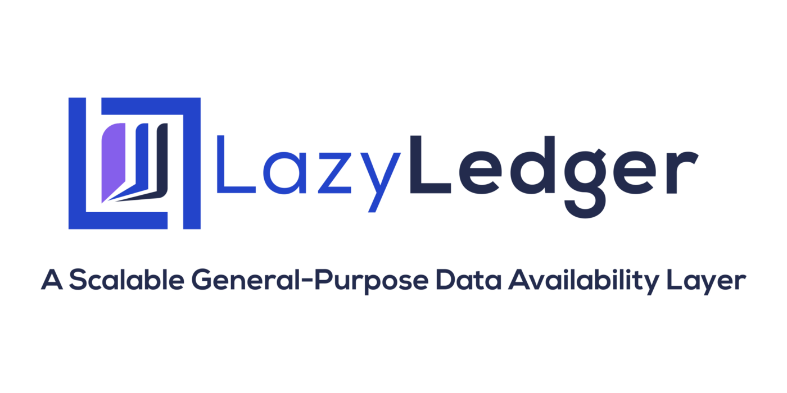

# LazyLedger Core

<!-- markdownlint-disable -->

<!-- markdownlint-enable -->

LazyLedger Core will power the LazyLedger main chain by leveraging Tendermint.

LazyLedger itself is a scale-out data availability-focused minimal blockchain.
It allows users to post arbitrary data on the chain, as well as define their own execution layers.
This data is ordered on-chain but not executed. This allows for the first scalable data layer for
decentralised applications, including optimistic rollup sidechains. Additionally, this design allows developers to
define their own execution environments.

Read this [blog post](https://medium.com/lazyledger/lazyledger-a-scalable-general-purpose-data-availability-layer-for-trust-minimized-sidechains-and-82d901963de9)
to learn more about what we are building.

## Documentation

The original [whitepaper](https://arxiv.org/abs/1905.09274) and the
[specification](https://github.com/LazyLedger/lazyledger-specs) which we are currently wrapping up can give you
a more detailed overview what to expect from this repository.

### Minimum requirements

| Requirement | Notes            |
|-------------|------------------|
| Go version  | Go1.15 or higher |

### Install

See the [install instructions](/docs/introduction/install.md).

### Quick Start

- [Single node](/docs/introduction/quick-start.md)
- [Local cluster using docker-compose](/docs/networks/docker-compose.md)

## Contributing

Before contributing to the project, please take a look at the [contributing guidelines](CONTRIBUTING.md)
and the [style guide](STYLE_GUIDE.md).

Join the community at [Telegram](https://t.me/lazyledgerchat) or jump onto the [Forum](https://talk.lazyledger.io/)
to get more involved into discussions.

Learn more by reading the code and the
[specifications](https://github.com/LazyLedger/lazyledger-specs).

## Versioning

### Semantic Versioning

LazyLedger Core uses [Semantic Versioning](http://semver.org/) to determine when and how the version changes.
According to SemVer, anything in the public API can change at any time before version 1.0.0

## Resources

### LazyLedger

- [LazyLedger Ethereum research post](https://ethresear.ch/t/a-data-availability-blockchain-with-sub-linear-full-block-validation/5503)
- [LazyLedger academic paper](https://arxiv.org/abs/1905.09274)
- [Blog](https://medium.com/lazyledger)
- [Project web site](https://lazyledger.io/)
- [Academic LazyLedger prototype](https://github.com/LazyLedger/lazyledger-prototype)
- [Follow LazyLedger on Twitter](https://twitter.com/lazyledger_io)

### Tendermint Core

For more information on Tendermint Core and pointers to documentation for Tendermint visit
this [repository](https://github.com/tendermint/tendermint).
