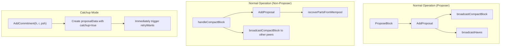
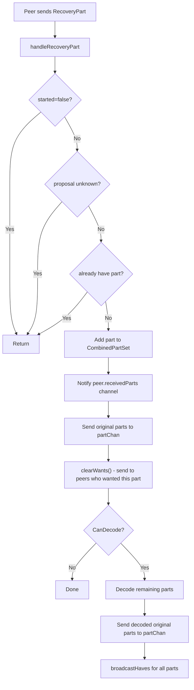

# Propagation Reactor State Specification

This document describes the state management architecture of the propagation reactor, which handles efficient block data distribution using compact blocks and erasure coding recovery.

## Overview

The propagation reactor operates as a state machine with two primary modes: **processing** and **waiting**. It maintains state at three levels:
1. **Reactor-level**: Global state for the reactor instance
2. **Proposal-level**: Cached block data indexed by height and round
3. **Peer-level**: Per-peer tracking of haves, wants, and requests

## State Structures

### Reactor State (`Reactor`)

```go
type Reactor struct {
    peerstate       map[p2p.ID]*PeerState  // Per-peer state
    *ProposalCache                          // Embedded proposal cache
    currentProposer crypto.PubKey           // Current round's proposer
    started         atomic.Bool             // Processing mode flag
    ticker          *time.Ticker            // Catchup retry timer
    partChan        chan types.PartInfo     // Output: parts to consensus reactor
    proposalChan    chan ProposalAndSrc     // Output: new proposals discovered
}
```

### Proposal Cache State (`ProposalCache`)

```go
type ProposalCache struct {
    proposals map[int64]map[int32]*proposalData  // Indexed by height, then round
    height    int64                               // Current consensus height
    round     int32                               // Current consensus round
    currentProposalPartsCount atomic.Int64        // Parts count for request limiting
}

type proposalData struct {
    compactBlock *proptypes.CompactBlock   // The compact block metadata
    block        *proptypes.CombinedPartSet // Original + parity parts
    maxRequests  *bits.BitArray             // Tracks parts at request limit
    catchup      bool                        // True if from catchup (not normal propagation)
}
```

### Peer State (`PeerState`)

```go
type PeerState struct {
    state             map[int64]map[int32]*partState  // Per height/round state
    concurrentReqs    atomic.Int64                     // In-flight request count
    remainingRequests map[int64]map[int32]int          // Requests peer still needs
    receivedHaves     chan request                     // Queue of have notifications
    receivedParts     chan partData                    // Queue of received parts
    canRequest        chan struct{}                    // Signal to process requests
}

type partState struct {
    haves    *bits.BitArray  // Parts this peer claims to have
    wants    *bits.BitArray  // Parts this peer has requested from us
    requests *bits.BitArray  // Parts we've requested from this peer
}
```

## Operating Modes

### Waiting Mode (`started = false`)

The reactor starts in waiting mode. In this mode:
- `handleHaves()` returns early without processing
- `handleWants()` returns early without processing
- `handleRecoveryPart()` returns early without processing
- `retryWants()` skips execution

This mode exists to prevent the propagation reactor from processing messages before the consensus state is ready.

### Processing Mode (`started = true`)

Activated by calling `StartProcessing()`. In this mode:
- All message handlers process incoming data
- The catchup retry ticker triggers `retryWants()` periodically
- Request/response flows operate normally

## State Transitions

### Mode Transitions

The reactor transitions from **Waiting** to **Processing** mode via `StartProcessing()`. This is a one-way transition.

### Height/Round Transitions

**SetHeightAndRound(h, r)**:
- Updates height and round
- Resets all peer concurrent request counters
- Does NOT prune old data

**Prune(committedHeight)**:
- Sets height = committedHeight
- Deletes all proposals for heights < committedHeight
- Deletes all peer state for heights < committedHeight
- Resets request counters and retry ticker

### Proposal Lifecycle



## Catchup vs Normal Mode

The reactor handles two distinct data acquisition paths:

| Aspect | Normal Mode | Catchup Mode |
|--------|-------------|--------------|
| Trigger | `handleCompactBlock()` | `AddCommitment()` |
| `catchup` flag | `false` | `true` |
| Has `PartsHashes` | Yes (from compact block) | No (empty) |
| Processes haves | Yes | No (returns early) |
| Request proofs | No | Yes (`Prove: true`) |
| Data source | Peer gossip | Direct requests via `retryWants()` |

### Catchup Detection

Catchup blocks are identified by having no `PartsHashes` in the compact block:

```go
if len(cb.PartsHashes) == 0 {
    // This is a catchup block
    return
}
```

## Relevance Filtering

The `relevant(height, round)` function determines if a message should be processed:

```go
func (p *ProposalCache) relevant(height int64, round int32) bool {
    if height < p.height { return false }  // Past height
    if round < p.round { return false }    // Past round
    return true
}
```

This prevents processing stale data from earlier heights/rounds.

## Concurrency Control

### Request Limiting

The reactor limits concurrent requests per peer using:

```go
func ConcurrentRequestLimit(peersCount, partsCount int) int64 {
    faultyValCount := math.Ceil(float64(peersCount) * 0.33)
    faultyPartCount := float64(partsCount) / 2
    return int64(math.Ceil(faultyPartCount / faultyValCount))
}
```

This ensures requests are distributed across peers, accounting for potentially faulty validators.

### Per-Part Request Limiting

Each part has a maximum request count based on block size:

```go
func ReqLimit(partsCount int) int {
    return int(math.Ceil(math.Max(1, 34/float64(partsCount))))
}
```

Smaller blocks allow more redundant requests per part.

### Mutex Protection

| Mutex | Protects | Location |
|-------|----------|----------|
| `mtx` | `peerstate` map, `currentProposer` | `Reactor` |
| `pmtx` | `proposals` map, `height`, `round` | `ProposalCache` |
| `mtx` (RWMutex) | `state` map, `remainingRequests` | `PeerState` |

Atomic variables are used for frequently accessed counters:
- `started` (Reactor)
- `concurrentReqs` (PeerState)
- `currentProposalPartsCount` (ProposalCache)

## Message Flow State Updates

### Have Message Flow

**handleHaves()** on receiving `HaveParts`:
1. Return early if `started=false`
2. Return early if proposal unknown
3. Return early if catchup block (no PartsHashes)
4. Update `peer.haves` BitArray
5. Check if peer has parts we need
6. Queue requests to `peer.receivedHaves` channel
7. Signal `peer.canRequest`

### Want Message Flow

**handleWants()** on receiving `WantParts`:
1. Return early if `started=false`
2. Return early if proposal unknown
3. Set `peer.remainingRequests[height][round]`
4. For parts we have: send `RecoveryPart`
5. For parts we don't have: add to `peer.wants` BitArray

### Recovery Part Flow



## Automatic Recovery

The reactor includes automatic catchup via a ticker-based retry mechanism:

```go
// Runs every RetryTime (6 seconds)
go func() {
    for {
        select {
        case <-reactor.ctx.Done():
            return
        case <-reactor.ticker.C:
            reactor.retryWants()
        }
    }
}()
```

`retryWants()` iterates over all unfinished heights and requests missing original parts from shuffled peers, ensuring eventual block completion even if some messages are lost.

## State Summary Table

| State Variable | Scope | Updated By | Effect |
|---------------|-------|-----------|--------|
| `started` | Reactor | `StartProcessing()` | Enables/disables message processing |
| `height`, `round` | ProposalCache | `SetHeightAndRound()`, `AddCommitment()`, `Prune()` | Controls relevance filtering |
| `proposals` | ProposalCache | `AddProposal()`, `AddCommitment()`, `prune()` | Stores block data |
| `peerstate` | Reactor | `AddPeer()`, `RemovePeer()` | Tracks connected peers |
| `state` (haves/wants/requests) | PeerState | Various handlers | Tracks per-peer block part state |
| `concurrentReqs` | PeerState | Request send/receive | Limits in-flight requests |
| `currentProposer` | Reactor | `SetProposer()` | Validates compact block signatures |

## Lifecycle Summary

**NewReactor()**:
- Initialize empty peerstate map
- Create ProposalCache from BlockStore
- Start retry ticker goroutine
- `started = false`

**StartProcessing()**:
- `started = true` (enables message handling)

**AddPeer(peer)**:
- Create new PeerState
- Start `requestFromPeer()` goroutine
- Send current compact block if available

**RemovePeer(peer)**:
- Cancel peer context
- Delete from peerstate map

**Prune(height)**:
- Delete old proposals and peer state
- Reset request counters
- Reset retry ticker

## Unverified Proposals Cache (Future State)

This section describes an addition to `PeerState` for caching compact blocks received from peers before they can be verified. This enables nodes that have fallen behind to rejoin consensus at the tip rather than staying partially behind.

### Problem Statement

When a node falls behind consensus, it misses compact blocks for heights it wasn't ready to receive. Currently, these compact blocks are discarded, causing the node to remain partially behind even after catching up on block data. The node cannot fully rejoin consensus at the tip because it lacks the proposals needed to participate in voting.

### Solution: Per-Peer Unverified Proposals Cache

Add an unverified proposals cache to `PeerState` that stores compact blocks received from each peer:

```go
const (
    // MaxUnverifiedProposals is the maximum number of compact blocks
    // that can be cached per peer. Keeps the lowest heights when full.
    MaxUnverifiedProposals = 10
)

type PeerState struct {
    // ... existing fields ...

    // unverifiedProposals stores compact blocks received from this peer
    // for heights we weren't ready to process. Indexed by height.
    // These have NOT been verified via the consensus reactor's verification
    // function. Limited to MaxUnverifiedProposals entries, keeping lowest heights.
    unverifiedProposals map[int64]*proptypes.CompactBlock
    unverifiedMtx       sync.RWMutex  // Protects unverifiedProposals
}
```

### State Management

#### Storage

Compact blocks are cached when validation fails for reasons that might be resolved later. This includes:
1. **Future height**: We don't know the proposer key for heights beyond H+1
2. **Current height, wrong round**: We may advance to that round later
3. **Proposer not set**: During catchup, the proposer key may not be set yet

When a compact block fails validation for a height >= current height:
1. Check if `unverifiedProposals` has room (< `MaxUnverifiedProposals`)
2. If full, check if this height is lower than the highest cached height
   - If lower: evict the highest height entry, store this one
   - If higher or equal: ignore this compact block (keep lowest heights)
3. Store the compact block in the sending peer's `unverifiedProposals[height]`
4. Do not discard - validation will be retried when height/round/proposer changes

**Important**: Proposals for past heights (< currentHeight) are NOT cached - they are discarded.

#### Retrieval

```go
// GetUnverifiedProposal returns an unverified compact block for the given height
// from any peer that has one cached. Returns nil if no cached compact block exists.
// The returned compact block has NOT been verified via the consensus reactor's
// verification function - the caller must verify before use.
func (r *Reactor) GetUnverifiedProposal(height int64) *proptypes.CompactBlock
```

This getter iterates through all peers and returns the first cached compact block found for the requested height.

#### Pruning

Cached compact blocks are pruned when:
- `Prune(committedHeight)` is called: delete all entries for heights ≤ committedHeight
- `RemovePeer()` is called: all cached compact blocks deleted with the `PeerState`
- Cache is full: evict highest height to make room for lower heights

### Application Flow

The key insight is that **receiving a compact block that fails validation may indicate we are behind or not yet ready**. We cache these proposals and retry validation when our state changes (height/round/proposer updates).

```mermaid
flowchart TD
    subgraph receive ["Receiving a Compact Block"]
        A[handleCompactBlock called] --> B[Try validateCompactBlock]
        B --> C{Validation passed?}
        C -->|Yes| D[processValidatedCompactBlock]
        C -->|No| E{height >= currentHeight?}
        E -->|No| F[Discard - past height]
        E -->|Yes| G{Cache has room?}
        G -->|Yes| H[Store in peer.unverifiedProposals]
        G -->|No| I{height < highest cached?}
        I -->|Yes| J[Evict highest, store this one]
        I -->|No| K[Ignore - keep lowest heights]
    end

    subgraph retry ["On State Change (SetHeightAndRound or SetProposer)"]
        L[applyCachedProposalIfAvailable called] --> M[GetUnverifiedProposal currentHeight]
        M --> N{Found cached proposal?}
        N -->|No| O[Done - wait for gossip]
        N -->|Yes| P{Proposal round == currentRound?}
        P -->|No| Q[Keep cached - may advance to that round]
        P -->|Yes| R[Try validateCompactBlock]
        R --> S{Valid?}
        S -->|No| T[Keep cached for retry]
        S -->|Yes| U[handleCachedCompactBlock]
        U --> V[Delete from cache]
    end

    subgraph apply ["External Apply (ApplyCachedProposal)"]
        W[Consensus reactor calls ApplyCachedProposal] --> X[GetUnverifiedProposal height]
        X --> Y{Found?}
        Y -->|No| Z[Return false]
        Y -->|Yes| AA[verifyFn callback]
        AA --> AB{Valid?}
        AB -->|No| AC[Return false - keep cached]
        AB -->|Yes| AD[handleCachedCompactBlock]
        AD --> AE[Return true]
    end
```



### Behind Detection

A node knows it is "behind" or "not ready" when:
1. It received a compact block that failed validation
2. That compact block was stored in a peer's `unverifiedProposals`
3. Common scenarios:
   - Future height: we haven't committed the previous block yet
   - Wrong round: we're at round 0 but received a proposal for round 1
   - Missing proposer: during catchup, the proposer key may not be set yet

### Request Behavior When Behind

When applying a cached compact block (i.e., when catching up), the request behavior differs from normal operation:

| Aspect | Normal Operation | Catching Up (from cache) |
|--------|------------------|--------------------------|
| Request original parts | Yes | Yes |
| Request parity parts | Yes | **No** |
| Reason | Full erasure coding benefit | Minimize bandwidth, only need original data |

This optimization reduces bandwidth usage during catchup since parity parts are only needed for the erasure coding recovery optimization, which is less critical when catching up.

### Implementation Considerations

1. **Memory bounds**: The `unverifiedProposals` cache is limited to `MaxUnverifiedProposals` (e.g., 10) entries per peer. When full, only compact blocks for lower heights are accepted, evicting the highest. This prevents memory exhaustion from malicious peers and prioritizes catching up on the nearest heights first.

2. **Compact block selection**: When multiple peers have cached compact blocks for the same height, iterate through peers and use the first one that passes verification.

3. **Verification timing**: Compact blocks are verified only when we're ready to process them (after committing the previous block), not when received. This avoids wasting CPU on compact blocks we may never use. Verification uses the same function provided by the consensus reactor that is used for normally-received proposals.

4. **Cache invalidation**: If we receive a different compact block for the same height from the same peer, the new one replaces the old one (last write wins per peer).

5. **Immediate part requests**: When a cached compact block is successfully verified and processed, `retryWants()` must be triggered immediately (similar to `AddCommitment`). This ensures parts are requested as soon as we know there's a block to fetch, rather than waiting for the next ticker interval. This is critical for fast catchup.

### State Summary (Updated)

| State Variable | Scope | Updated By | Effect |
|---------------|-------|-----------|--------|
| `unverifiedProposals` | PeerState | `handleCompactBlock()` (validation failure) | Stores compact blocks for catchup |
| ... | ... | ... | ... |

### Lifecycle (Updated)

**handleCompactBlock (validation fails, height >= currentHeight)**:
- Try `validateCompactBlock()` first
- If validation fails AND height >= currentHeight: cache in `unverifiedProposals`
- If validation fails AND height < currentHeight: discard (past height)
- Caching follows eviction rules (keep lowest heights)

**SetHeightAndRound (height H, round R)**:
- Update height and round
- Reset request counters
- Call `applyCachedProposalIfAvailable()` to retry cached proposals

**SetProposer (proposer key)**:
- Update current proposer
- Call `applyCachedProposalIfAvailable()` to retry cached proposals

**applyCachedProposalIfAvailable()**:
- Get cached proposal for current height
- If proposal round != current round: keep cached (may advance to that round)
- If proposal round == current round: try `validateCompactBlock()`
- If validation fails: keep cached for retry (proposer may not be set yet)
- If validation succeeds: process via `handleCachedCompactBlock()`, delete from cache

**RemovePeer**:
- Cancel peer context
- Delete from peerstate map
- `unverifiedProposals` deleted with PeerState

**Prune (committedHeight)**:
- Delete old proposals and peer state
- Delete `unverifiedProposals` entries for heights ≤ committedHeight
- Reset request counters
- Reset retry ticker

---

## Implementation Plan

This section provides a concise guide for implementing the Unverified Proposals Cache.

### Code Changes Overview

| File | Changes |
|------|---------|
| `peer_state.go` | Add cache field, storage/retrieval/prune methods |
| `commitment.go` | Refactor `handleCompactBlock` to cache proposals that fail validation |
| `reactor.go` | Add `GetUnverifiedProposal`, modify `Prune`, modify `SetHeightAndRound` |
| `catchup.go` | Add `applyCachedProposalIfAvailable` and `ApplyCachedProposal` |

### 1. PeerState Changes (`peer_state.go`)

Add to `PeerState` struct:
```go
unverifiedProposals map[int64]*proptypes.CompactBlock
```

**New methods:**

```go
// StoreUnverifiedProposal caches a compact block for a future height.
// Returns true if stored, false if rejected (cache full with lower heights).
func (d *PeerState) StoreUnverifiedProposal(cb *proptypes.CompactBlock) bool

// GetUnverifiedProposal returns cached compact block for height, or nil.
func (d *PeerState) GetUnverifiedProposal(height int64) *proptypes.CompactBlock

// pruneUnverifiedProposals removes entries for heights <= committedHeight.
func (d *PeerState) pruneUnverifiedProposals(committedHeight int64)
```

**Critical nuances:**
- Use existing `mtx` (RWMutex) for synchronization—no separate mutex needed
- Initialize map in `newPeerState()` alongside other maps
- Eviction logic: find max height in map, compare, evict if new height is lower
- `prune()` already iterates heights—extend it to also prune `unverifiedProposals`

### 2. handleCompactBlock Changes (`commitment.go`)

Refactor `handleCompactBlock` to cache proposals that fail validation:

```go
func (blockProp *Reactor) handleCompactBlock(cb *proptypes.CompactBlock, peer p2p.ID, proposer bool) {
    // Proposers skip validation since they created the block
    if proposer {
        blockProp.processValidatedCompactBlock(cb, peer, proposer)
        return
    }

    // Try to validate the compact block
    err := blockProp.validateCompactBlock(cb)
    if err != nil {
        // Validation failed - cache for later if it's for current or future height.
        // We cache because:
        // 1. Future height: we don't know the proposer key yet
        // 2. Current height, wrong round: we may advance to that round later
        // 3. Wrong proposer: proposer key may not be set yet (catchup scenario)
        blockProp.pmtx.Lock()
        currentHeight := blockProp.height
        blockProp.pmtx.Unlock()

        if cb.Proposal.Height >= currentHeight {
            if p := blockProp.getPeer(peer); p != nil {
                p.StoreUnverifiedProposal(cb)
            }
        }
        return
    }

    blockProp.processValidatedCompactBlock(cb, peer, proposer)
}

// processValidatedCompactBlock handles a compact block that has passed validation.
func (blockProp *Reactor) processValidatedCompactBlock(cb *proptypes.CompactBlock, peer p2p.ID, proposer bool) {
    // ... existing logic moved here ...
}
```

**Critical nuances:**
- Always try validation first - caching is the fallback for validation failures
- Cache proposals for current height (may have wrong round or missing proposer) AND future heights
- Only discard proposals for past heights (< currentHeight)
- Proposers bypass validation since they created the block

### 3. Reactor Changes (`reactor.go`)

**Add `GetUnverifiedProposal` method:**

```go
// GetUnverifiedProposal returns a cached compact block for the given height
// from any peer. Returns nil if none found.
func (blockProp *Reactor) GetUnverifiedProposal(height int64) *proptypes.CompactBlock {
    peers := blockProp.getPeers()
    for _, peer := range peers {
        if cb := peer.GetUnverifiedProposal(height); cb != nil {
            return cb
        }
    }
    return nil
}
```

**Modify `Prune` method (line 297):**

Add to the peer loop:
```go
for _, peer := range peers {
    peer.prune(prunePast)
    peer.pruneUnverifiedProposals(prunePast)  // Add this line
}
```

**Modify `SetHeightAndRound` method:**

Add call to check cached proposals when height/round changes:
```go
func (blockProp *Reactor) SetHeightAndRound(height int64, round int32) {
    blockProp.pmtx.Lock()
    blockProp.round = round
    blockProp.height = height
    blockProp.pmtx.Unlock()

    blockProp.ResetRequestCounts()

    // Check for cached proposals that might now be applicable.
    // This handles the case where we advance to a new round and have a cached
    // proposal for that round waiting to be applied.
    blockProp.applyCachedProposalIfAvailable()
}
```

### 4. Catchup Integration (`catchup.go`)

**Add internal method for automatic retry on state changes:**

```go
// applyCachedProposalIfAvailable checks for cached proposals at the current height/round
// and applies the first valid one. Called automatically after SetProposer or SetHeightAndRound.
//
// This function iterates through ALL peers' cached proposals for the current height/round,
// trying each one until it finds a valid proposal. This ensures a single invalid proposal
// from one peer doesn't block valid proposals from other peers.
func (blockProp *Reactor) applyCachedProposalIfAvailable() {
    blockProp.pmtx.Lock()
    currentHeight := blockProp.height
    currentRound := blockProp.round
    blockProp.pmtx.Unlock()

    // Check if we already have a proposal for this height/round (normal case)
    _, _, has := blockProp.GetProposal(currentHeight, currentRound)
    if has {
        return // Already have proposal, no need to check cache
    }

    // Iterate through all peers looking for a valid cached proposal
    peers := blockProp.getPeers()
    for _, peer := range peers {
        cb := peer.GetUnverifiedProposal(currentHeight)
        if cb == nil {
            continue // This peer has no cached proposal for this height
        }

        // Skip proposals for different rounds - they'll be tried when we advance
        if cb.Proposal.Round != currentRound {
            continue
        }

        // Try to validate this proposal
        if err := blockProp.validateCompactBlock(cb); err != nil {
            continue // Try next peer's cached proposal
        }

        // Found a valid proposal - apply it
        blockProp.handleCachedCompactBlock(cb)

        // Clean up the cache entry for this peer only
        peer.DeleteUnverifiedProposal(currentHeight)
        return
    }
}
```

**Critical nuances for `applyCachedProposalIfAvailable`:**
- Called from both `SetProposer` and `SetHeightAndRound`
- **Iterates ALL peers** - a single invalid proposal doesn't block valid ones
- Only tries proposals that match current height AND round
- Invalid proposals stay cached (for future retry or pruning)
- Only deletes from the specific peer whose proposal was valid

**Add public method for external callers (e.g., consensus reactor):**

```go
// ApplyCachedProposal checks for and applies a cached compact block for the given height.
// Called by consensus reactor after committing a block. Returns true if a cached
// proposal was found and successfully applied.
//
// This function iterates through ALL peers' cached proposals for the given height,
// trying each one until it finds a valid proposal.
func (blockProp *Reactor) ApplyCachedProposal(height int64, verifyFn func(*proptypes.CompactBlock) error) bool {
    peers := blockProp.getPeers()
    for _, peer := range peers {
        cb := peer.GetUnverifiedProposal(height)
        if cb == nil {
            continue // This peer has no cached proposal for this height
        }

        // Verify using consensus reactor's verification function
        if err := verifyFn(cb); err != nil {
            continue // Try next peer's cached proposal
        }

        // Found a valid proposal - apply it
        blockProp.handleCachedCompactBlock(cb)

        // Clean up the cache entry for this peer only
        peer.DeleteUnverifiedProposal(height)
        return true
    }
    return false
}

// handleCachedCompactBlock processes a verified cached compact block.
// Similar to handleCompactBlock but skips re-validation and triggers immediate catchup.
func (blockProp *Reactor) handleCachedCompactBlock(cb *proptypes.CompactBlock) {
    // Add to proposal cache (similar to AddProposal but mark catchup=true)
    blockProp.AddProposal(cb)

    // Mark as catchup to skip parity requests
    blockProp.pmtx.Lock()
    if prop := blockProp.proposals[cb.Proposal.Height][cb.Proposal.Round]; prop != nil {
        prop.catchup = true
    }
    blockProp.pmtx.Unlock()

    // Recover any parts from mempool
    blockProp.recoverPartsFromMempool(cb)

    // Immediately trigger part requests (like AddCommitment)
    go blockProp.retryWants()
}
```

**Critical nuances:**
- `verifyFn` is provided by the consensus reactor—it has access to the proposer key for that height
- Setting `catchup = true` ensures `retryWants` only requests original parts (existing behavior)
- Don't broadcast cached blocks—let normal gossip continue independently
- Trigger `retryWants()` in goroutine (like `AddCommitment`) to avoid blocking caller

### 5. Consensus Reactor Integration

The consensus reactor must call `ApplyCachedProposal` after committing a block. This is outside the propagation package but the interface is:

```go
// After committing block at height H:
if applied := propReactor.ApplyCachedProposal(H+1, verifyCompactBlock); applied {
    // Cached proposal was found and applied, catchup in progress
}
```

The `verifyCompactBlock` function should:
1. Check proposer key matches expected proposer for that height
2. Verify proposal signature
3. Verify compact block signature
4. Validate POLRound and block size (same checks as `validateCompactBlock`)

---

## Testing Plan

### Unit Tests (`peer_state_test.go`)

**Add tests for cache operations:**

```go
func TestPeerState_StoreUnverifiedProposal(t *testing.T)
```
- Store single proposal, retrieve it
- Store at max capacity, verify oldest (lowest height) kept
- Store proposal for height lower than max cached, verify eviction of highest
- Store proposal for height higher than max cached when full, verify rejection
- Store different proposal for same height, verify replacement (last write wins)

```go
func TestPeerState_pruneUnverifiedProposals(t *testing.T)
```
- Prune with entries at heights [5, 6, 7, 8], prune(6), verify [7, 8] remain
- Prune with no entries, verify no panic
- Prune all entries, verify empty map

### Unit Tests (`reactor_test.go`)

**Add test for reactor-level retrieval:**

```go
func TestReactor_GetUnverifiedProposal(t *testing.T)
```
- No peers have cached proposal, returns nil
- One peer has proposal, returns it
- Multiple peers have proposals for same height, returns first found

### Integration Test: Extend `TestGapCatchup` (`catchup_test.go`)

The existing `TestGapCatchup` tests catching up via `AddCommitment`. Extend it to test the cache path:

```go
func TestGapCatchup_FromCache(t *testing.T) {
    p2pCfg := defaultTestP2PConf()
    reactors, _ := createTestReactors(3, p2pCfg, false, "")
    n1, n2, n3 := reactors[0], reactors[1], reactors[2]
    cleanup, _, sm := state.SetupTestCase(t)
    t.Cleanup(func() { cleanup(t) })

    // Create proposal for height 2 (n1 is "ahead")
    prop, ps, _, metaData := createTestProposal(t, sm, 2, 0, 2, 1000000)
    cb, parityBlock := createCompactBlock(t, prop, ps, metaData)

    // n2 and n3 are at height 1 (behind)
    n2.SetHeightAndRound(1, 0)
    n3.SetHeightAndRound(1, 0)

    // n1 adds and broadcasts the proposal
    n1.AddProposal(cb)
    _, parts, _, _ := n1.getAllState(prop.Height, prop.Round, true)
    parts.SetProposalData(ps, parityBlock)

    // Simulate n1 sending compact block to n2 and n3
    // Since they're at height 1, it should be cached
    n2.handleCompactBlock(cb, n1.self, false)
    n3.handleCompactBlock(cb, n1.self, false)

    // Verify cached (not in proposal cache, but in peer's unverified cache)
    _, _, has := n2.GetProposal(prop.Height, prop.Round)
    require.False(t, has, "should not be in proposal cache yet")

    cachedCb := n2.GetUnverifiedProposal(prop.Height)
    require.NotNil(t, cachedCb, "should be in unverified cache")

    // Now n2 "commits" height 1 and checks cache
    n2.Prune(1)
    n2.SetHeightAndRound(2, 0)

    // Apply cached proposal (mock verification that passes)
    applied := n2.ApplyCachedProposal(2, func(cb *proptypes.CompactBlock) error {
        return nil // Accept for testing
    })
    require.True(t, applied)

    // Verify proposal is now in cache and marked as catchup
    _, propData, has := n2.GetProposal(prop.Height, prop.Round)
    require.True(t, has)
    require.True(t, propData.catchup, "should be marked as catchup")

    // Wait for catchup to complete
    time.Sleep(800 * time.Millisecond)
    require.True(t, propData.IsComplete())
}
```

**Key test scenarios covered:**
1. Future-height compact block is cached (not processed)
2. Cached proposal retrieved after height advances
3. `ApplyCachedProposal` processes and marks as catchup
4. Catchup completes successfully

### Integration Test: Pruning (`catchup_test.go`)

```go
func TestUnverifiedCache_Pruning(t *testing.T)
```
- Cache proposals for heights [5, 6, 7]
- Call `Prune(5)`
- Verify heights 6, 7 remain in cache, height 5 removed

### Edge Case Tests

```go
func TestUnverifiedCache_CapacityEviction(t *testing.T)
```
- Fill cache to `MaxUnverifiedProposals`
- Add proposal for lower height, verify highest evicted
- Add proposal for higher height, verify rejected

```go
func TestHandleCompactBlock_FutureHeight_UnknownPeer(t *testing.T)
```
- Receive compact block for future height from unknown peer
- Verify no panic, block not cached

### Validation Retry Tests

```go
func TestApplyCachedProposalIfAvailable_WrongRound(t *testing.T)
```
- Cache proposal for height 2, round 1
- Node is at height 2, round 0
- Call `SetHeightAndRound(2, 0)` - should NOT apply (wrong round)
- Verify proposal stays cached
- Call `SetHeightAndRound(2, 1)` - should attempt validation

```go
func TestApplyCachedProposalIfAvailable_ValidationFailsKeepsCached(t *testing.T)
```
- Cache proposal for height 2, round 0
- Node at height 2, round 0 but proposer not set
- Call `applyCachedProposalIfAvailable()` - validation fails
- Verify proposal stays cached (NOT deleted)
- Set proposer, call again - should now apply

```go
func TestHandleCompactBlock_CachesCurrentHeightWrongRound(t *testing.T)
```
- Node at height 2, round 0
- Receive proposal for height 2, round 1
- Verify proposal is cached (not discarded)
- Advance to round 1, verify proposal can be applied

---

## Implementation Checklist

- [ ] Add `unverifiedProposals` field to `PeerState`
- [ ] Initialize map in `newPeerState()`
- [ ] Implement `StoreUnverifiedProposal` with eviction logic
- [ ] Implement `GetUnverifiedProposal` on PeerState
- [ ] Implement `pruneUnverifiedProposals`
- [ ] Modify `handleCompactBlock` to cache ANY proposal that fails validation (height >= current)
- [ ] Add `processValidatedCompactBlock` to separate validation from processing
- [ ] Add `GetUnverifiedProposal` to Reactor (iterates peers)
- [ ] Modify `Prune` to call peer pruning
- [ ] Modify `SetHeightAndRound` to call `applyCachedProposalIfAvailable`
- [ ] Add `applyCachedProposalIfAvailable` (internal, keeps cached on failure)
- [ ] Add `ApplyCachedProposal` (public, for consensus reactor)
- [ ] Add `handleCachedCompactBlock`
- [ ] Add unit tests for PeerState cache operations
- [ ] Add unit tests for Reactor retrieval
- [ ] Add integration test `TestGapCatchup_FromCache`
- [ ] Add pruning test
- [ ] Add capacity/eviction edge case tests
- [ ] Add validation retry tests
- [ ] Update consensus reactor to call `ApplyCachedProposal` after commit
