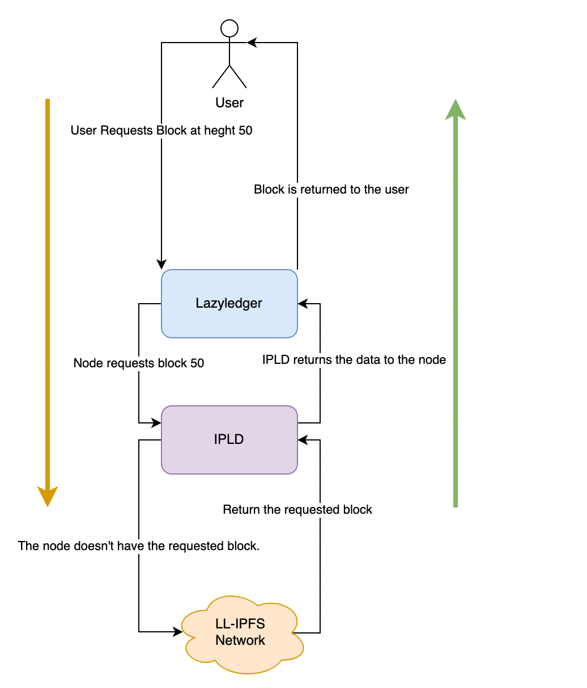

# ADR 001: Erasure Coding Block Propagation

## Changelog

- 16-2-2021: Created

## Context

Block propagation is currently done by splitting the block into arbitrary chunks and gossiping them to validators via a gossip routine. While this does not have downsides it does not meet the needs of the Celestia chain. The celestia chain requires blocks to be encoded in a different way and for the proposer to not propagate the chunks to peers.

Celestia wants validators to pull the block from a IPFS network. What does this mean? As I touched on earlier the proposer pushes the block to the network, this in turn means that each validator downloads and reconstructs the block each time to verify it. Instead Celestia will encode and split up the block via erasure codes, stored locally in the nodes IPFS daemon. After the proposer has sent the block to IPFS and received the CIDs it will include them into the proposal. This proposal will be gossiped to other validators, once a validator receives the proposal it will begin requesting the CIDs included in the proposal.

There are two forms of a validator, one that downloads the block and one that samples it. What does sampling mean? Sampling is the act of checking that a portion or entire block is available for download.

## Detailed Design

The proposed design is as follows.

### Types

The proposal and vote types have a BlockID, this will be replaced with a header hash. The proposal will contain add fields.

The current proposal will be updated to include required fields. The entirety of the message will be reworked at a later date. To see the extent of the needed changes you can visit the [spec repo](https://github.com/celestiaorg/celestia-specs/blob/master/src/specs/proto/consensus.proto#L19)

```proto
message Proposal {
  SignedMsgType             type      = 1;
  int64                     height    = 2;
  int32                     round     = 3;
  int32                     pol_round = 4;

  +++
    // 32-byte hash
  bytes last_header_hash = 5;
  // 32-byte hash
  bytes last_commit_hash = 6;
    // 32-byte hash
  bytes consensus_root = 7;
  FeeHeader fee_header = 8;
  // 32-byte hash
  bytes state_commitment = 9;
  uint64 available_data_original_shares_used = 10;
  AvailableDataHeader available_data_header = 11;
  +++

  google.protobuf.Timestamp timestamp = 12
      [(gogoproto.nullable) = false, (gogoproto.stdtime) = true];
  bytes signature = 12;
}
```

```proto
// Vote represents a prevote, precommit, or commit vote from validators for
// consensus.
message Vote {
  SignedMsgType type     = 1;
  int64         height   = 2;
  int32         round    = 3;
  +++
  bytes header_hash      = 4;
  +++
  google.protobuf.Timestamp timestamp = 5
      [(gogoproto.nullable) = false, (gogoproto.stdtime) = true];
  bytes validator_address = 6;
  int32 validator_index   = 7;
  bytes signature         = 8;
}
```

See [specs](https://github.com/celestiaorg/celestia-specs/blob/master/src/specs/data_structures.md#vote) for more details on the vote.

### Disk Storage

Currently celestia-core stores all blocks in its store. Going forward only the headers of the blocks within the unbonding period will be stored. This will drastically reduce the amount of storage required by a celestia-core node. After the unbonding period all headers will have the option of being pruned.

Proposed amendment to `BlockStore` interface

```go
type BlockStore interface {
 Base() int64
 Height() int64
 Size() int64

 LoadBlockMeta(height int64) *types.BlockMeta
 LoadHeader(height int64) *types.Header
 LoadDAHeader(height int64) *types.DataAvailabilityHeader

 SaveHeaders(header *types.Header, daHeader *types.DataAvailabilityHeader, seenCommit *types.Commit)

 PruneHeaders(height int64) (uint64, error)

 LoadBlockCommit(height int64) *types.Commit
 LoadSeenCommit(height int64) *types.Commit
}
```

Along side these changes the rpc layer will need to change. Instead of querying the LL-core store, the node will redirect the query through IPFS.

Example:

When a user requests a block from the LL node, the request will be set to the IPLD plugin. If the IPLD does not have the requested block, it will make a request to the celestia IPFS network for the required CIDs. If the full node does not have the DAheader they will not be able to request the block data.



The goal is to not change the public interface for RPC's. It is yet to be seen if this is possible. This means that CIDs will need to be set and loaded from the store in order to get all the related block information a user requires.

## Status

Proposed


### Positive

- Minimal breakage to public interface
- Only store the block in a single place (IPFS)
- Reduce the public interface of the storage within Celestia.

### Negative

- User requests may take more time to process

### Neutral

## References
