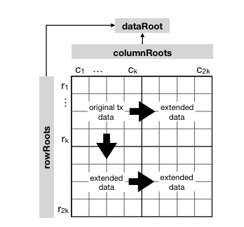

# ADR 002: Sampling erasure coded Block chunks

## Changelog

- 26-2-2021: Created

## Context

In Tendermint's block gossiping each peer gossips random parts of block data to peers.
For Celestia, we need nodes (from light-clients to validators) to be able to sample row-/column-chunks of the erasure coded
block (aka the extended data square) from the network.
This is necessary for Data Availability proofs.



A high-level, implementation-independent formalization of above mentioned sampling and Data Availability proofs can be found in:
[_Fraud and Data Availability Proofs: Detecting Invalid Blocks in Light Clients_](https://fc21.ifca.ai/papers/83.pdf).

For the time being, besides the academic paper, no other formalization or specification of the protocol exists.
Currently, the Celestia specification itself only describes the [erasure coding](https://github.com/celestiaorg/celestia-specs/blob/master/src/specs/data_structures.md#erasure-coding)
and how to construct the extended data square from the block data.

This ADR:
- describes the high-level requirements
- defines the API that and how it can be used by different components of Celestia (block gossiping, block sync, DA proofs)
- documents decision on how to implement this.


The core data structures and the erasure coding of the block are already implemented in celestia-core ([#17], [#19], [#83]).
While there are no ADRs for these changes, we can refer to the Celestia specification in this case.
For this aspect, the existing implementation and specification should already be on par for the most part.
The exact arrangement of the data as described in this [rationale document](https://github.com/celestiaorg/celestia-specs/blob/master/rationale/message_block_layout.md)
in the specification can happen at app-side of the ABCI boundary.
The latter was implemented in [celestiaorg/celestia-app#21](https://github.com/celestiaorg/celestia-app/pull/21)
leveraging a new ABCI method, added in [#110](https://github.com/celestiaorg/celestia-core/pull/110).
This new method is a sub-set of the proposed ABCI changes aka [ABCI++](https://github.com/tendermint/spec/pull/254).

Mustafa Al-Bassam (@musalbas) implemented a [prototype](https://github.com/celestiaorg/celestia-prototype)
whose main purpose is to realistically analyse the protocol.
Although the prototype does not make any network requests and only operates locally, it can partly serve as a reference implementation.
It uses the [rsmt2d] library.

The implementation will essentially use IPFS' APIs. For reading (and writing) chunks it
will use the IPLD [`DagService`](https://github.com/ipfs/go-ipld-format/blob/d2e09424ddee0d7e696d01143318d32d0fb1ae63/merkledag.go#L54),
more precisely the [`NodeGetter`](https://github.com/ipfs/go-ipld-format/blob/d2e09424ddee0d7e696d01143318d32d0fb1ae63/merkledag.go#L18-L27)
and [`NodeAdder`](https://github.com/ipfs/go-ipld-format/blob/d2e09424ddee0d7e696d01143318d32d0fb1ae63/merkledag.go#L29-L39).
As an optimization, we can also use a [`Batch`](https://github.com/ipfs/go-ipld-format/blob/d2e09424ddee0d7e696d01143318d32d0fb1ae63/batch.go#L29)
to batch adding and removing nodes.
This will be achieved by passing around a [CoreAPI](https://github.com/ipfs/interface-go-ipfs-core/blob/b935dfe5375eac7ea3c65b14b3f9a0242861d0b3/coreapi.go#L15)
object, which derive from the IPFS node which is created along a with a tendermint node (see [#152]).
This code snippet does exactly that (see the [go-ipfs documentation] for more examples):
```go
// This constructs an IPFS node instance
node, _ := core.NewNode(ctx, nodeOptions)
// This attaches the Core API to the constructed node
coreApi := coreapi.NewCoreAPI(node)
```

The above mentioned IPLD methods operate on so called [ipld.Nodes].
When computing the data root, we can pass in a [`NodeVisitor`](https://github.com/celestia/nmt/blob/b22170d6f23796a186c07e87e4ef9856282ffd1a/nmt.go#L22)
into the Namespaced Merkle Tree library to create these (each inner- and leaf-node in the tree becomes an ipld node).
As a peer that requests such an IPLD node, the Celestia IPLD plugin provides the [function](https://github.com/celestiaorg/celestia-core/blob/ceb881a177b6a4a7e456c7c4ab1dd0eb2b263066/p2p/ipld/plugin/nodes/nodes.go#L175)
`NmtNodeParser` to transform the retrieved raw data back into an `ipld.Node`.

A more high-level description on the changes required to rip out the current block gossiping routine,
including changes to block storage-, RPC-layer, and potential changes to reactors is either handled in [ADR 001](./adr-001-block-propagation.md),
and/or in a few smaller, separate followup ADRs.

## Alternative Approaches

Instead of creating a full IPFS node object and passing it around as explained above
 - use API (http)
 - use ipld-light
 - use alternative client

Also, for better performance
 - use [graph-sync], [IPLD selectors], e.g. via [ipld-prime]

Also, there is the idea, that nodes only receive the [Header] with the data root only
and, in an additional step/request, download the DA header using the library, too.
While this feature is not considered here, and we assume each node that uses this library has the DA header, this assumption
is likely to change when flesh out other parts of the system in more detail.
Note that this also means that light clients would still need to validate that the data root and merkelizing the DA header yield the same result.

## Decision

> This section records the decision that was made.
> It is best to record as much info as possible from the discussion that happened. This aids in not having to go back to the Pull Request to get the needed information.

> - TODO: briefly summarize github, discord, and slack discussions (?)
> - also mention Mustafa's prototype and compare both apis briefly (RequestSamples, RespondSamples, ProcessSamplesResponse)
> - mention [ipld experiments]


## Detailed Design

Add a package to the library that provides the following features:
 1. sample a given number of random row/col indices of extended data square given a DA header and indicate if successful or timeout/other error occurred
 2. store the block in the network by adding it to the peer's local Merkle-DAG whose content is discoverable via a DHT
 3. store the sampled chunks in the network
 4. reconstruct the whole block from a given DA header
 5. get all messages of a particular namespace ID.

We mention 5. here mostly for completeness. Its details will be described / implemented in a separate ADR / PR.

Apart from the above mentioned features, we informally collect additional requirements:
- where randomness is needed, the randomness source should be configurable
- all replies by the network should be verified if this is not sufficiently covered by the used libraries already (IPFS)
- where possible, the requests to the network should happen in parallel (without DoSing the proposer for instance).

This library should be implemented as two new packages:

First, a sub-package should be added to the layzledger-core [p2p] package
which does not know anything about the core data structures (Block, DA header etc).
It handles the actual network requests to the IPFS network and operates on IPFS/IPLD objects
directly and hence should live under [p2p/ipld].
To a some extent this part of the stack already exists.

Second, a high-level API that can "live" closer to the actual types, e.g., in a sub-package in [celestia-core/types]
or in a new sub-package `da`.

We first describe the high-level library here and describe functions in
more detail inline with their godoc comments below.

### API that operates on celestia-core types

As mentioned above this part of the library has knowledge of the core types (and hence depends on them).
It does not deal with IPFS internals.

```go
// ValidateAvailability implements the protocol described in https://fc21.ifca.ai/papers/83.pdf.
// Specifically all steps of the protocol described in section
// _5.2 Random Sampling and Network Block Recovery_ are carried out.
//
// In more detail it will first create numSamples random unique coordinates.
// Then, it will ask the network for the leaf data corresponding to these coordinates.
// Additionally to the number of requests, the caller can pass in a callback,
// which will be called on for each retrieved leaf with a verified Merkle proof.
//
// Among other use-cases, the callback can be useful to monitoring (progress), or,
// to process the leaf data the moment it was validated.
// The context can be used to provide a timeout.
// TODO: Should there be a constant = lower bound for #samples
func ValidateAvailability(
    ctx context.Context,
    dah *DataAvailabilityHeader,
    numSamples int,
    onLeafValidity func(namespace.PrefixedData8),
) error { /* ... */}

// RetrieveBlockData can be used to recover the block Data.
// It will carry out a similar protocol as described for ValidateAvailability.
// The key difference is that it will sample enough chunks until it can recover the
// full extended data square, including original data (e.g. by using rsmt2d.RepairExtendedDataSquare).
func RetrieveBlockData(
    ctx context.Context,
    dah *DataAvailabilityHeader,
    api coreiface.CoreAPI,
    codec rsmt2d.Codec,
    ) (types.Data, error) {/* ... */}

// PutBlock operates directly on the Block.
// It first computes the erasure coding, aka the extended data square.
// Row by row ir calls a lower level library which handles adding the
// the row to the Merkle Dag, in our case a Namespaced Merkle Tree.
// Note, that this method could also fill the DA header.
// The data will be pinned by default.
func (b *Block) PutBlock(ctx context.Context, nodeAdder ipld.NodeAdder) error
```

We now describe the lower-level library that will be used by above methods.
Again we provide more details inline in the godoc comments directly.

`PutBlock` is a method on `Block` as the erasure coding can then be cached, e.g. in a private field
in the block.

### Changes to the lower level API closer to IPFS (p2p/ipld)

```go
// GetLeafData takes in a Namespaced Merkle tree root transformed into a Cid
// and the leaf index to retrieve.
// Callers also need to pass in the total number of leaves of that tree.
// Internally, this will be translated to a IPLD path and corresponds to
// an ipfs dag get request, e.g. namespacedCID/0/1/0/0/1.
// The retrieved data should be pinned by default.
func GetLeafData(
    ctx context.Context,
    rootCid cid.Cid,
    leafIndex uint32,
    totalLeafs uint32, // this corresponds to the extended square width
    api coreiface.CoreAPI,
) ([]byte, error)
```

`GetLeafData` can be used by above `ValidateAvailability` and `RetrieveBlock` and
`PutLeaves` by `PutBlock`.

### A Note on IPFS/IPLD

In IPFS all data is _content addressed_ which basically means the data is identified by its hash.
Particularly, in the Celestia case, the root CID identifies the Namespaced Merkle tree including all its contents (inner and leaf nodes).
This means that if a `GetLeafData` request succeeds, the retrieved leaf data is in fact the leaf data in the tree.
We do not need to additionally verify Merkle proofs per leaf as this will essentially be done via IPFS on each layer while
resolving and getting to the leaf data.

> TODO: validate this assumption and link to code that shows how this is done internally

### Implementation plan

As fully integrating Data Available proofs into tendermint, is a rather larger change we break up the work into the
following packages (not mentioning the implementation work that was already done):

1. Flesh out the changes in the consensus messages ([celestia-specs#126], [celestia-specs#127])
2. Flesh out the changes that would be necessary to replace the current block gossiping ([ADR 001](./adr-001-block-propagation.md))
3. Add the possibility of storing and retrieving block data (samples or whole block) to celestia-core (this ADR and related PRs).
4. Integrate above API (3.) as an addition into celestia-core without directly replacing the tendermint counterparts (block gossip etc).
5. Rip out each component that will be redundant with above integration in one or even several smaller PRs:
    - block gossiping (see ADR 001)
    - modify block store (see ADR 001)
    - make downloading full Blocks optional (flag/config)
    - route some RPC requests to IPFS (see ADR 001)


## Status

Proposed

## Consequences

### Positive

- simplicity & ease of implementation
- can reuse an existing networking and p2p stack (go-ipfs)
- potential support of large, cool, and helpful community
- high-level API definitions independent of the used stack

### Negative

- latency
- being connected to the public IPFS network might be overkill if peers should in fact only care about a subset that participates in the Celestia protocol
- dependency on a large code-base with lots of features and options of which we only need a small subset of

### Neutral
- two different p2p layers exist in celestia-core

## References

- https://github.com/celestiaorg/celestia-core/issues/85
- https://github.com/celestiaorg/celestia-core/issues/167

- https://docs.ipld.io/#nodes
- https://arxiv.org/abs/1809.09044
- https://fc21.ifca.ai/papers/83.pdf
- https://github.com/tendermint/spec/pull/254


[#17]: https://github.com/celestiaorg/celestia-core/pull/17
[#19]: https://github.com/celestiaorg/celestia-core/pull/19
[#83]: https://github.com/celestiaorg/celestia-core/pull/83

[#152]: https://github.com/celestiaorg/celestia-core/pull/152

[celestia-specs#126]: https://github.com/celestiaorg/celestia-specs/issues/126
[celestia-specs#127]: https://github.com/celestiaorg/celestia-specs/pulls/127
[Header]: https://github.com/celestiaorg/celestia-specs/blob/master/src/specs/data_structures.md#header

[go-ipfs documentation]: https://github.com/ipfs/go-ipfs/tree/master/docs/examples/go-ipfs-as-a-library#use-go-ipfs-as-a-library-to-spawn-a-node-and-add-a-file
[ipld experiments]: https://github.com/celestia/ipld-plugin-experiments
[ipld.Nodes]: https://github.com/ipfs/go-ipld-format/blob/d2e09424ddee0d7e696d01143318d32d0fb1ae63/format.go#L22-L45
[graph-sync]: https://github.com/ipld/specs/blob/master/block-layer/graphsync/graphsync.md
[IPLD selectors]: https://github.com/ipld/specs/blob/master/selectors/selectors.md
[ipld-prime]: https://github.com/ipld/go-ipld-prime

[rsmt2d]: https://github.com/celestiaorg/rsmt2d


[p2p]: https://github.com/celestiaorg/celestia-core/tree/0eccfb24e2aa1bb9c4428e20dd7828c93f300e60/p2p
[p2p/ipld]: https://github.com/celestiaorg/celestia-core/tree/0eccfb24e2aa1bb9c4428e20dd7828c93f300e60/p2p/ipld
[celestia-core/types]: https://github.com/celestiaorg/celestia-core/tree/0eccfb24e2aa1bb9c4428e20dd7828c93f300e60/types
