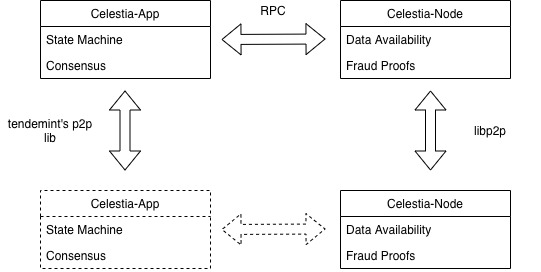

# ADR 007: From Ukraine, with Love

## Changelog

- 2021-08-20: Initial Description
- 2022-05-03: Update pointing to ADR 008

## Context

Currently, our fork of tendermint includes changes to how to erasure block data, minor changes to the header to commit
to that data, additions to serve data availability sampling, along with some miscellaneous modification to adhere to the
spec. Instead of incorporating all of these changes into our fork of tendermint, we will only make the strictly
necessary changes and the other services and their code to the new celestia-node repo. Notably, we will also refactor
some of the remaining necessary changes to be more isolated from the rest of the tendermint codebase. Both of these
strategies should significantly streamline pulling updates from upstream, and allow us to iterate faster since most
changes will be isolated to celestia-node.

Update: many of the changes described below have since been minimized or removed. Please see ADR 008 for a summarized list of changes. Notably, we removed intermediate state roots, adopted two new methods from ABCI++ instead of PreprocessTxs, and are still signing over the PartSetHeader. 

## Decision

Treat tendermint more as a "black box".

## Detailed Design

### Overview

We keep the bare-minimum changes to tendermint in our fork, celestia-core. Where necessary and possible we augment the
tendermint node in a separate process, via celestia-node, which communicates with the tendermint node via RPC. All data
availability sampling logic, including all Celestia-specific networking logic not already provided by tendermint, is
moved into celestia node:



The detailed design of celestia-node will be defined in the repository itself.

### Necessary changes to tendermint

#### Changing the repo import names to celestiaorg

- Rebrand (https://github.com/celestiaorg/celestia-core/pull/476)

#### Changes to the README.md other basic things

- update github templates (https://github.com/celestiaorg/celestia-core/pull/405)
- update README.md (https://github.com/celestiaorg/celestia-core/pull/10)

#### Adding the extra types of block data

- Update core data types (https://github.com/celestiaorg/celestia-core/pull/17)
    - Create the Message/Messages types
    - Proto and the tendermint version
    - Create the IntermediateStateRoots type
    - Proto and the tendermint version
- Data availability for evidence (https://github.com/celestiaorg/celestia-core/pull/19)
    - Add both types to `types.Data`
    - Modify proto
    - Add `EvidenceData` to `types.Data`

#### Add the HeaderHash to the Commit

- Add header hash to commit(https://github.com/celestiaorg/celestia-core/pull/198)

#### Adding the consts package in types

#### Remove iavl as a dependency

- remove iavl as a dependency (https://github.com/celestiaorg/celestia-core/pull/129)

#### Using the `DataAvailabilityHeader` to calculate the DataHash

The `DataAvailabilityHeader` struct will be used by celestia-core as well as by the celestia-node. It might make sense
to (eventually) move the struct together with all the DA-related code into a separate repository and go-module.
@Wondertan explored this as part of [#427](https://github.com/celestiaorg/celestia-core/pull/427#issue-674512464). This
way all client implementations can depend on that module without running into circular dependencies. Hence, we only
describe how to hash the block data here:

- Update core types (https://github.com/celestiaorg/celestia-core/pull/17)
    - Replace the `Data.Hash()` with `DAH.Hash()`
    - Use DAH to fill DataHash when filling the header
    - Fill the DAH when making a block to generate the data hash

#### Add availableDataOriginalSharesUsed to the header

- Add availableDataOriginalSharesUsed to the header (https://github.com/celestiaorg/celestia-core/pull/262)

#### Reap some number of transactions probably using the app or some other mech

- Enforce a minimum square size (https://github.com/celestiaorg/celestia-core/pull/282)
- Use squares with a width that is a power of two(https://github.com/celestiaorg/celestia-core/pull/331)
- Adopt reamping from the mempool to max square size (https://github.com/celestiaorg/celestia-core/issues/77)
- Proposal: Decide on a mech to pick square size and communicate that to the
  app (https://github.com/celestiaorg/celestia-core/issues/454)
- Also see ABCI++ for a less hacky solution

#### Filling the DAH using share merging and splitting

- Compute Shares (not merged) (https://github.com/celestiaorg/celestia-core/pull/60)
    - part II (not merged) (https://github.com/celestiaorg/celestia-core/pull/63)
    - while this was not merged, we will need some function to compute the shares that make up the block data
- Share Splitting (https://github.com/celestiaorg/celestia-core/pull/246)
    - Serialize each constituent of block data
    - Split into shares
        - Txs (contiguous)
        - Messages (not contiguous)
        - Evidence (contiguous)
        - IntermediateStateRoots (contiguous)
- Combine shares into original square
- ExtendBlockData
- Generate nmt root of each row and col
- Use those roots to generate the DataHash
- Share Merging (https://github.com/celestiaorg/celestia-core/pull/261)
    - Sort by namespace
    - Parse each reserved type
    - Parse remaining messages

#### Add the wrapper around nmt to erasure namespaces

- Implement rsmt tree wrapper for nmt (https://github.com/celestiaorg/celestia-core/pull/238)

#### Add PreprocessTxs to ABCI

- Add PreprocessTxs method to ABCI (https://github.com/celestiaorg/celestia-core/pull/110)
- Add method to ABCI interface
- Create sync and async versions
- Add sync version the the CreateProposalBlock method of BlockExecutor

#### Fill the DAH while making the block

- Basic DA functionality (https://github.com/celestiaorg/celestia-core/pull/83)

#### Only produce blocks on some interval

- Control block times (https://github.com/cometbft/cometbft/issues/5911)

#### Stop signing over the PartSetHeader

- Replace canonical blockID with just a hash in the CononicalVote
- Replace the LastBlockID in the header with just a hash

#### Optionally remove some unused code

- Removing misc unsued code (https://github.com/celestiaorg/celestia-core/pull/208)
- Remove docs deployment (https://github.com/celestiaorg/celestia-core/pull/134)
- Start deleting docs (https://github.com/celestiaorg/celestia-core/pull/209)
- Remove tendermint-db in favor of badgerdb (https://github.com/celestiaorg/celestia-core/pull/241)
- Delete blockchain 2 until further notice (https://github.com/celestiaorg/celestia-core/pull/309)
- We don’t need to support using out of process apps

#### Nice to Haves

- More efficient hashing (https://github.com/celestiaorg/celestia-core/pull/351)

We should also take this opportunity to refactor as many additions to tendermint into their own package as possible.
This will hopefully make updating to future versions of tendermint easier. For example, when we fill the data
availability header, instead of using a method on `Block`, it could be handled by a function that takes `types.Data` as
input and returns the DAH, the number of shares used in the square, along with the obligatory error.

```go
func FillDataAvailabilityHeader(data types.Data) (types.DataAvailabilityHeader, numOrigDataShares, error)
```

We could perform a similar treatment to the `splitIntoShares` methods and their helper method `ComputeShares`. Instead
of performing the share splitting logic in those methods, we could keep it in a different package and instead call the
equivalent function to compute the shares.

Beyond refactoring and some minor additions, we will also have to remove and revert quite a few changes to get to the
minimum desired changes specified above.

### Changes that will need to be reverted

#### IPLD Plugin

- Introduction (https://github.com/celestiaorg/celestia-core/pull/144)
- Initial integration (https://github.com/celestiaorg/celestia-core/pull/152)
- Custom Multihash (https://github.com/celestiaorg/celestia-core/pull/155)
- Puting data during proposal (https://github.com/celestiaorg/celestia-core/pull/178)
- Module name (https://github.com/celestiaorg/celestia-core/pull/151)
- Update rsmt2d (https://github.com/celestiaorg/celestia-core/pull/290)
- Make plugin a package (https://github.com/celestiaorg/celestia-core/pull/294)

#### Adding DAH to Stuff

- Adding DAH to Proposal (https://github.com/celestiaorg/celestia-core/pull/248/files)
- Blockmeta (https://github.com/celestiaorg/celestia-core/pull/372)

#### Embedding DAS

- GetLeafData (https://github.com/celestiaorg/celestia-core/pull/212)
- RetrieveBlockData (https://github.com/celestiaorg/celestia-core/pull/232)
- ValidateAvailability (https://github.com/celestiaorg/celestia-core/pull/270)
- Prevent double writes to IPFS (https://github.com/celestiaorg/celestia-core/pull/271)
- Stop Pinning (https://github.com/celestiaorg/celestia-core/pull/276)
- Rework IPFS Node (https://github.com/celestiaorg/celestia-core/pull/334)
- Refactor for putting the block (https://github.com/celestiaorg/celestia-core/pull/338)
- Config for IPFS node (https://github.com/celestiaorg/celestia-core/pull/340)
- IPLD Dag instead of CoreAPI (https://github.com/celestiaorg/celestia-core/pull/352)
- Adding the DAG to the blockstore (https://github.com/celestiaorg/celestia-core/pull/356)
- Saving and Loading using IPFS (https://github.com/celestiaorg/celestia-core/pull/374)
- Manual Providing (https://github.com/celestiaorg/celestia-core/pull/375)
- Refactor node provider (https://github.com/celestiaorg/celestia-core/pull/400)
- DAS in light client workaround (https://github.com/celestiaorg/celestia-core/pull/413)

#### BlockID and PartSetHeader

- Decouple ParSetHeader from BlockID (https://github.com/celestiaorg/celestia-core/pull/441)
- Stop Signing over the PartSetHeader (https://github.com/celestiaorg/celestia-core/pull/457)
- We still don’t want to sign over the PartSetHeader, but we will not be able to use the same mechanism used in the
  linked PR, as that way requires decoupling of the PSH from the BlockID
- Remove PSH from some consensus messages (https://github.com/celestiaorg/celestia-core/pull/479)

Note: This ADR overrides ADR 005 Decouple BlockID and the PartSetHeader. The PartSetHeader and the BlockID will mostly
remain the same. This will make pulling changes from upstream much easier

## Status

Accepted

## Consequences

### Positive

- Pulling changes from upstream is streamlined
- Separation of functionality will help us iterate faster
- Creates a great opportunity for reconsidering past design choices without fully starting from scratch
- Prepare for future designs
- Don’t have to have two p2p stacks in a single repo

### Negative

- Perform some computation multiple times
- Running multiple nodes instead of a single node is less convenient for node operators (but only in the case the full
  celestia-node wants to participate in the consensus protocol)

## References

Tracking Issue #491
